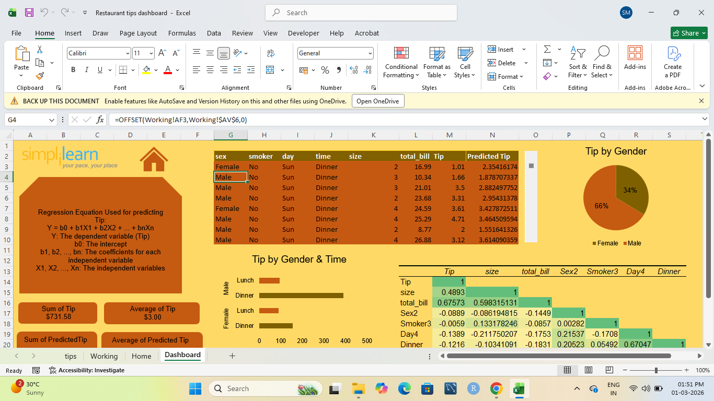
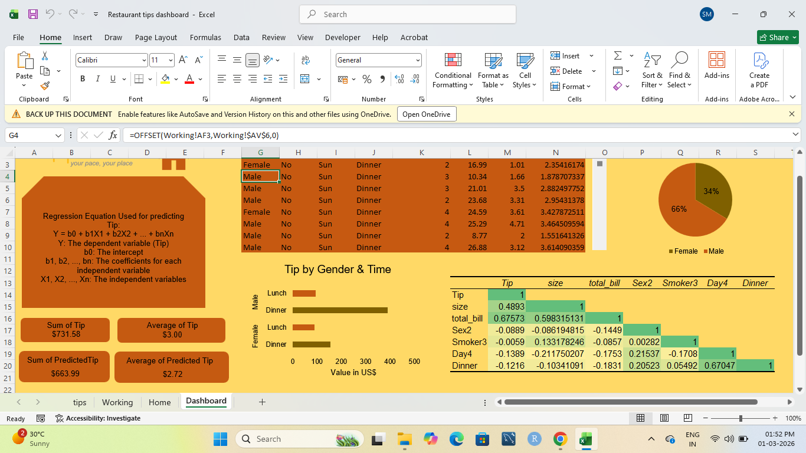
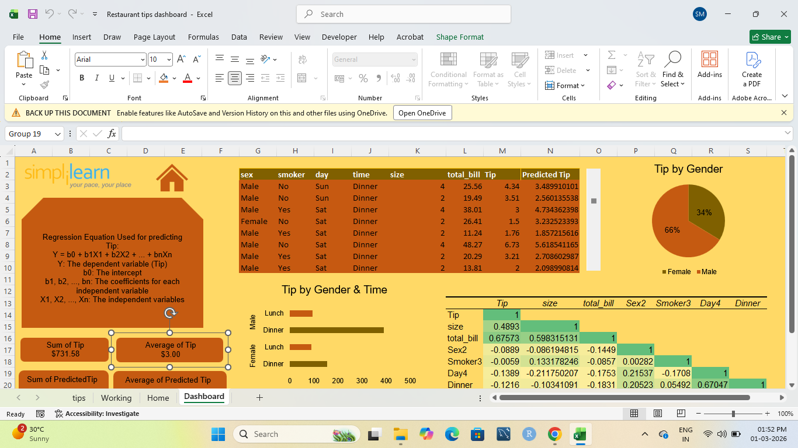
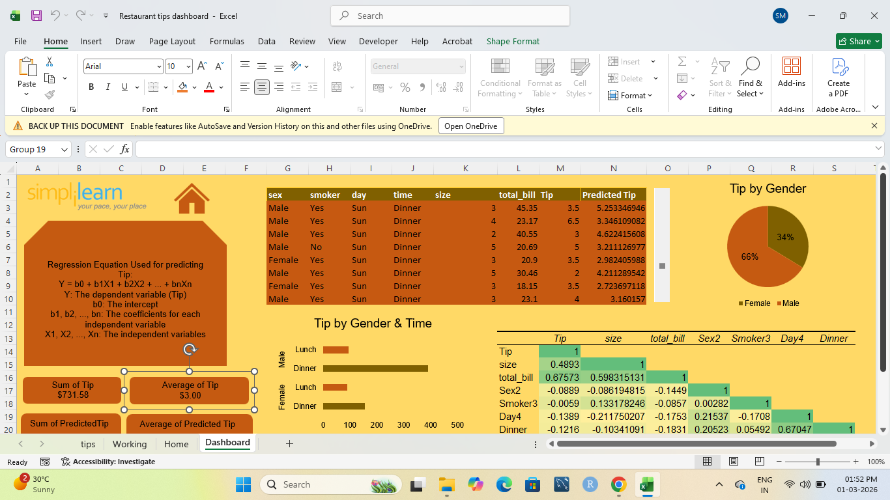
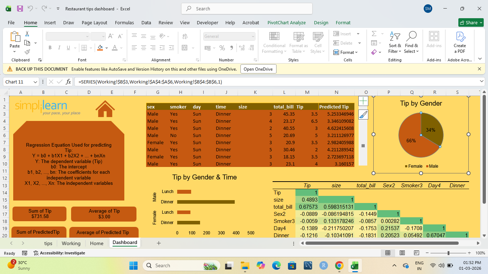

# Restaurant Tips Analysis & Prediction Dashboard (Excel)

## 📌 Project Overview
Developed an interactive Restaurant Tips Dashboard in Microsoft Excel to analyze tipping behavior and predict tip amounts using regression analysis. The dashboard combines data visualization with statistical modeling to generate business insights.

## 🛠 Tools & Techniques Used
- Microsoft Excel
- Pivot Tables & Pivot Charts
- Data Cleaning & Transformation
- Regression Analysis
- Correlation Matrix
- KPI Card Design
- Interactive Dashboard Layout

## 📊 Key Metrics Analyzed
- Total Tip Amount
- Average Tip
- Predicted Tip
- Tip by Gender
- Tip by Time (Lunch vs Dinner)
- Tip vs Total Bill Relationship
- Correlation between variables

## 📈 Predictive Modeling
Used a multiple linear regression model:

Y = b0 + b1X1 + b2X2 + ... + bnXn  

Where:
- Y = Tip (dependent variable)
- X variables = Total Bill, Size, Gender, Smoker, Day, Time
- b0 = Intercept
- b1...bn = Coefficients

The model was used to calculate predicted tip values and compare them with actual tips.

## 🔍 Insights Derived
- Dinner time generated higher total tips compared to lunch.
- Tip amount strongly correlates with total bill size.
- Group size influences tipping behavior.
- Certain demographic variables show moderate correlation with tipping.

## 📷 Dashboard Features
- KPI summary section
- Regression model explanation
- Correlation heatmap
- Interactive filtering
- Comparative analysis by gender and time

---

## 📷 Dashboard Preview

This project demonstrates my ability to combine data analysis, visualization, and predictive modeling in Excel to generate actionable business insights.
